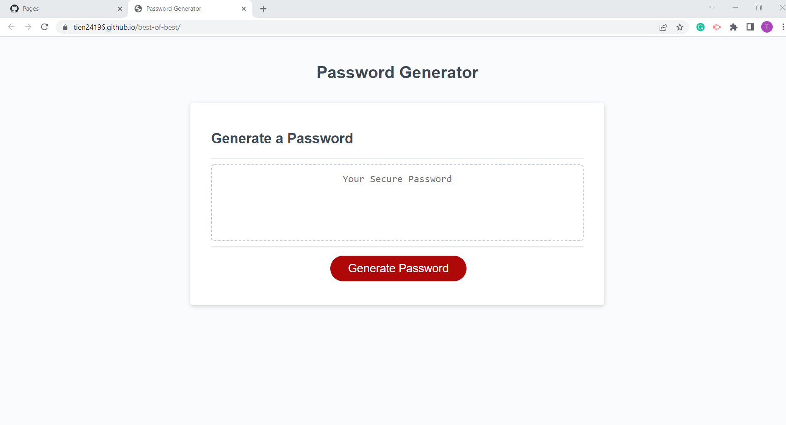

# Challenge III

## Description
A password is randomly generated based on criteria that the user provides when prompted. The program then prompts the user to define if they would like to include numbers, characters, uppercase and/or lowercase letters. If the user selects none to all criteria, the program will ask it to select at least each one and will loop back through the prompts.

## Screenshot

## Deployed Application

https://tien24196.github.io/best-of-best/
